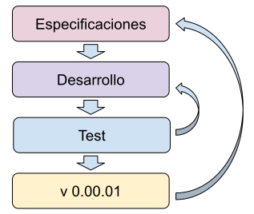
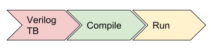
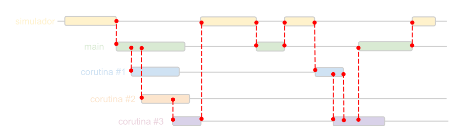

# COCOTB
## Testbench en Python
  
  
#### Andres Demski

---

## Agenda: Introducción
- Puesta en marcha de PCs
- Introduccion al SW
- Introducción a Python

----

## Agenda: Basico

- Testbenchs:
    - Flujo de trabajo
    - Por que hacerlos?
    - TB en lenguajes HDL
- COCOTB:
    - Arquitectura
    - Hello World
    - yield y corutinas
    - No mas waveforms

----

## Agenda: Avanzado
- Estructuras de test y portabilidad
    - Driver
    - Monitores
    - Interfaces
- Practicas
    - SPI
    - AXI Stream
    - AXI4

---

## Software necesario

<ul>
<span class="fragment (appear)" data-fragment-index="1"><li>
python
</li><span class="fragment (appear)" data-fragment-index="2"><li>
cocotb
</li><span class="fragment (appear)" data-fragment-index="3"><li>
iverilog / ghdl
</li><span class="fragment (appear)" data-fragment-index="5"><li>
gtkwave
</li><span class="fragment (appear)" data-fragment-index="6">
<p style="text-align: center;">
o  
</p><p style="font-size: 3em; text-align: center;">
**Docker**
</p>
</ul>
----

# Instalación clásica
<p style="text-align: center;"> (para el que no quiera usar docker) </p>

----

### GHDL e iverilog
```bash
sudo apt-get install iverilog
git clone https://github.com/tgingold/ghdl.git ghdl_src/ && cd ghdl_src && \
    ./configure --prefix=/usr/local --with-llvm-config && make && \
    sudo make install && cd ..
```

### GTKwave

```bash
sudo apt-get install gtkwave
```

### cocotb

```bash
pip install cocotb
```

----
# 
# Docker

----

### Que es Docker?


----

### Instalación
```bash
curl -fsSL https://get.docker.com -o get-docker.sh
sudo sh get-docker.sh
sudo usermod -aG docker your-user
# log out and back in
```

----

### Preparanto las herramientas...

Crear imagen
```bash
docker build -f .docker/Dockerfile -t spl2019 .
docker pull andresdemski/spl2019
```
Hello World
```bash
docker run andresdemski/spl2019 echo "Hello World"
```

----

Clonar el repo 
```bash
git clone https://github.com/andresdemski/spl2019_cocotb.git
```

Setear el entorno
```bash
source utils/env.sh
```

Cocotb test
```bash
make -C ejemplos/cocotest
```

---

# 
# PYTHON

----

### Ventajas

* Opensource  
* Multiplataforma  
* Sintaxis sensilla  
* OOP  
* Escalable para grandes aplicaciones  
* Librerias y soporte en la comunidad  
* En continuo desarrollo
* Garbage collector

### Desventajas

* Rendimiento  

----

## Amplicaciones
* Web
* Backend
* Automatización
* DSP
* Simulación
* Inteligencia Artificial (ML, NN, LR, etc)
* Calculadora
* Manejo de base de datos
* Lenguaje "plasticola"

----

## Sintaxis
* No tiene fin de linea
* Case sensitive
* Bloques por identación
* Parecida a C y Matlab

----

## Tipos de datos
int  
```python
a = 5; a = 10; a = 1000000; a = 10000000000000000
```

bool
```python
a = True
a = False
```

float
```python
a = 5.1; a = 10.2e6; a = 1e6
```

complex
```python
a = 1 + 1j; a = 10.2e6j; a = 1e3 + 1e6j
```

----

string
```python
a = "Hola"
a = a + " Mundo " # "Hola Mundo "
b = a * 2 # Hola Mundo Hola Mundo
res = b.split(' ') # ["Hola", "Mundo"]
```

bytes
```python
a = b"hola"
```

list
```python
a = [11, 22, 33, 44]
a[0] # 11
a[3] # 44
a[-1] # 44
a[-2] # 33
a[0:2] # [11, 22]
```
----

tuplas
```python
a = (11, 22, 33, 44)
```

diccionarios
```python
a = {"a": 1, "b": 2, "hola": 3, 10: "hola" }
a["a"] # 1
a["b"] # 2
a["hola"] # 3
a[10] # "hola"
```

----

## Estructuras de control:

```python
if x < 0:
    print("x < 0")
elif x < 1:
    print("0 <= x < 1")
else:
    print("1 <= x")

# Comparaciones:
== , <=, <, >, >=, is, in, !=, or, and
```

```python
for i in iterable: # range(3), [0, 1, 2], (1, 2, 3), {"a":1, "b":2}.keys()
    print(i)
```

```python
with open('archivo.txt') as f:
    data = f.read()
```

----

### Funciones, generadores y clases

Funciones
```python
def funcion(arg1, arg2):
    res = arg1 + arg2
    return res
```

Clases
```python
class Complejo():
    def __init__(self, real, img):
        self.real = real
        self.img = img
    def abs(self):
        return (self.real**2 + self.img**2)**0.5

cplx = Complejo(1,1)
print(cplx.abs())
        
```

----

Generadores

```python
def my_range(end):
    i = 0
    while i < end:
        yield i
        i += 1

gen = my_range(5)
next(gen) # 0
next(gen) # 1
...
next(gen) # 4
next(gen) # ERROR!

for i in my_range(5):
    print(i)
```
----
### Sintaxis extra

List comprehensions
```python
a = [ 3*i for i in iter if condition]
```

Funciones lambda
```python
my_pow = lambda x, p: x**p
my_pow(2, 3) # 8
```

----
### Errores
Excepciones y asserts

```python
raise Exception("Mensaje")

class MyException(Exception):
    pass

raise MyException("Mensaje")
assert a < 5, "Mensaje si a no cumple la condición"
```

try, except, finally

```python
try:
    alguna_funcion_con_error()
except MyExeption:
    hacer_algo()
except:
    hacer_otra_cosa()
finally:
    hacer_siempre_al_final()
```

----

## Practica
\#1
```python
Hacer una clase que sea capaz de abrir un archivo de texto y
contar:

* Letras: obj.count('a')
* Lineas obj.count_lines()
* Palabras: obj.count_words()
# Recomendacion: import re; help(re);

```
\#2
```python
Editar la clase anterior para que tenga un metodo que realice
cuantas veces se repiten las palabras (no case sensitive) 
retornando un diccionario:

obj.statistic()
# texto: Hola Mundo HOLA mundo hOlA hola
# return: {'hola':3, 'mundo':1,}
```

----

\#3
```python
Usando el paquete time:
Hacer una clase TicToc para contar tiempos. Y almacene en una 
lista los periodos contados:

for i in range(3):
    obj.tic()
    time.sleep(i)
    elapsed = obj.toc() # returns the elapsed time

obj.get_elapsed_ times() 
# En este caso retorna [1.0012, 2.040, 3.008]
obj.get_start_times() 
# Retorna cuando se hicieron los tic en formato legible
```

---

# Testbenchs
----
### Flujo de trabajo

#  <!-- .element height="50%" width="50%"-->

----

### Plataforma de test
#  <!-- .element height="70%" width="50%"-->

----

### Simulaciones clásicas
```verilog
module tb();
  reg [3:0] a, b;
  wire [3:0] out;
  core DUT (.a(a), .b(b), .out(out));
  initial begin
    a = 4'b0000;
    #20
    a = 4'b1111;
    ...
    b = 4'b1010;
    #20
    $finish;
  end
```
#  <!-- .element width="60%""-->

----

#### Problemas de los TB clasicos

* Sintaxis poco amigable
* Capacidad reducida y complicada de comunicarse con otras aplicaciones
* Mantenimiento complicado
* Baja portabilidad
* La sincronización de eventos es complicada
* Se debe hacer un toplevel diferente al sintetizado para poder simular
* Frameworks (UVM, UVVM, OVM, OSVVM) dificiles de aprender

---

#  <!-- .element width="30%"-->
# COCOTB
### COroutine based COsimulation TestBench

----

### Arquitectura

#  <!-- .element width="100%"-->

----

### Como lanzar un test?

#  <!-- .element width="60%"-->

```bash
make TESTCASE=hello_world MODULE=test_hello_world
```

----

#### Que pasa por atras?

#  <!-- .element width="100%"-->

---

### Como arrancamos?
#### Makefile

```
# VERILOG/VHDL_SOURCES: Lista de archivos HDL
VERILOG_SOURCES=./example.v

# TOPLEVEL: Toplevel del diseño HDL
TOPLEVEL=example

# MODULE: Modulo de python a lanzar
MODULE=cocotest

# TESTCASE: Función de python que se va a correr (es opcional)
TESTCASE=hello_world,world_hello

# COCOTB_REDUCED_LOG_FMT: Para tener logs mas legibles
export COCOTB_REDUCED_LOG_FMT

# Importar los makefiles de cocotb
COCOTB=$(shell cocotb-config --makefiles)
include $(COCOTB)/Makefile.inc
include $(COCOTB)/Makefile.sim
```
----

### Como arrancamos?
#### Escribir un test
```python
import cocotb
from cocotb.triggers import Timer

@cocotb.test()
def hello_world(dut):
    cocotb.log.info("Hello World")
    yield Timer(1, units='us')
```
#### Make
```bash
make
```

----

### Practica #1
Tomando como ejemplo el test ubicado en `ejemplos/cocotest`, hacer un
test desde cero escribiendo los archivos `Makefile` y `test.py`. 
Se puede usar cualquier archivo HDL que tengas o utilizar el del ejemplo.

----

### Asignación de señales

----

### Seder recurso al simulador

#  <!-- .element width="100%"-->

----

### Practica #2

Utilizando los fuentes en `practica/clock_gen`, hacer un test que genere
un clock de 10ns de periodo.

Utilizar el comando `make gtkwave` para ver las waveforms

----

### Corutinas

----

### Practica #3

Realizar lo mismo que en la práctica #2 pero con una corutinas. Utilizar
TESTCASE en lo posible.

```python
def testcase_practica2(dut):
    ...

def testcase_practica3(dut):
    yield clock_generator(cycles=10)

    for _ in range(10):
        yield clock_generator(cycles=1)
```

----

### Fork

```python
# Lanzar una corutina
cocotb.fork(corutina(argumentos))

# Esperar a que termine
cor = cocotb.fork(corutina(argumentos))
yield cor.join()

# Matar una corutina
cor = cocotb.fork(corutina(argumentos))
cor.kill()
```

----

### Práctica 4

Utilizar la cortina hecha en la practica #3 y hacer que corra en paralelo
al test. Hacer que el test espere la finalización de la corutina.

----

### Pensando en paralelo
### Por que yield? Que significa
### Ejemplo #1: Contador con reset
### Ejemplo #2: Contador con enable
## Test results
### Success, Faiule & Error
### Practica #1: Sumador

# Estructuras "avanzadas" de test
## Drivers
## Monitores
## Loggers
## Orientado a objetos
## Tests y test factory
## Resultados
## Ejemplo #3: Simple interface
## Practica #2: AXI Stream
### sumador con codigo HLS

# Practicas
## SPI con SI
### datos tx
### secuencia
### datos rx
### frecuencia

# Cheatsheet
### Triggers
### Results
### Fork 
### corutina
### test


